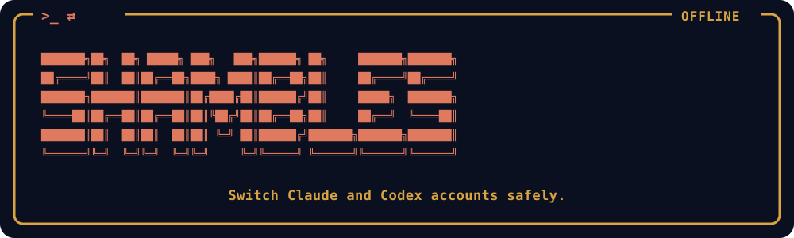

# Shambles



<details>
<summary>ASCII version</summary>

```text
╔═[ >_ ⇄ ]═════════════════════════════════════════════════════[ OFFLINE ]═╗
║                                                                          ║
║  ███████╗██╗  ██╗ █████╗ ███╗   ███╗██████╗ ██╗     ███████╗███████╗     ║
║  ██╔════╝██║  ██║██╔══██╗████╗ ████║██╔══██╗██║     ██╔════╝██╔════╝     ║
║  ███████╗███████║███████║██╔████╔██║██████╔╝██║     █████╗  ███████╗     ║
║  ╚════██║██╔══██║██╔══██║██║╚██╔╝██║██╔══██╗██║     ██╔══╝  ╚════██║     ║
║  ███████║██║  ██║██║  ██║██║ ╚═╝ ██║██████╔╝███████╗███████╗███████║     ║
║  ╚══════╝╚═╝  ╚═╝╚═╝  ╚═╝╚═╝     ╚═╝╚═════╝ ╚══════╝╚══════╝╚══════╝     ║
║                                                                          ║
║              Switch Claude and Codex accounts safely.                    ║
╚══════════════════════════════════════════════════════════════════════════╝
```

</details>

**Switch between Claude Code and Codex accounts without waiting for a
verification email.** Use a desktop window, a terminal dashboard, or a plain
CLI. Everything runs on your machine. Shambles never contacts your account.

```bash
curl -fsSL https://raw.githubusercontent.com/ianchendev/Shambles/main/scripts/install.sh | bash
shambles
```

**[Install](#install)** · **[Will it work for you?](#will-it-work-for-you)** ·
**[First five minutes](#your-first-five-minutes)** ·
**[Commands](#commands)** · **[Is it safe?](#is-it-safe)** ·
**[Troubleshooting](#troubleshooting)**

---

## Why is it called "Shambles"?

The name comes from One Piece. **Shambles** (シャンブルズ, *shanburuzu*) is one
of Trafalgar Law's abilities. He marks out an area, picks two things inside
it, and makes them trade places at once. Neither one travels the distance
between them. Each just ends up where the other was.

This tool does that with your logins. Work and Personal trade places in an
instant, and neither account has to sign in again.

---

## The problem

Claude Code reads its config from `~/.claude` and nowhere else. The VS Code
extension ignores environment variables. So there is no supported way to keep
two accounts. Codex has the same limit: `~/.codex/auth.json` holds one account.

Shambles gives each account its own folder and swaps a single file into place.

```text
   ~/.shambles/                                    what the vendor reads
   │
   ├── claude/
   │   ├── Work/     credentials.json ─────┐
   │   │             account.json          ├──► ~/.claude/.credentials.json
   │   ├── Personal/ credentials.json ─────┘     ~/.claude.json  (identity key
   │   │             account.json                                 only, spliced)
   │   └── active  → "Work"
   │
   └── codex/
       ├── Personal/ credentials.json ─────────► ~/.codex/auth.json
       └── active  → "Personal"

   Everything else in ~/.claude stays put: projects/, plugins/,
   settings.json, file-history/. Every account shares them, which is
   how Claude Code works on its own.
```

Adding an account opens your browser. Shambles does not handle that part. It
runs the vendor's own `claude auth login` or `codex login`, and those commands
do the whole sign-in.

**Why you skip the email wait.** The verification email belongs to the *first*
sign-in only. After that, a **refresh token** keeps you logged in, and each
use mints a new one with a fresh deadline. Shambles saves that token per
account, so later switches are instant. An account needs a new email only if
you leave it unused until its deadline passes.

That deadline varies, so Shambles reads your real value instead of guessing.
Samples ranged from about 4 days (macOS, Max 5x) to about 28 days (Linux,
Team). See [the evidence](docs/token-storage.md). An account you use often
never gets close.

Rate limits still apply per account, on the vendor's servers. Switching gives
you the other account's quota. It does not pool or stretch anyone's limit.

---

## Install

**One command.** The script picks the right binary for your OS and CPU from
the latest [Release](https://github.com/ianchendev/Shambles/releases) and puts
it in `~/.local/bin`. No sudo, nothing to build.

```bash
curl -fsSL https://raw.githubusercontent.com/ianchendev/Shambles/main/scripts/install.sh | bash

# or pin a release
curl -fsSL https://raw.githubusercontent.com/ianchendev/Shambles/main/scripts/install.sh | bash -s v2.1.0
```

**Windows PowerShell** installs `shambles.exe` and its windowed twin
`shamblesw.exe` into `%LOCALAPPDATA%\Shambles`, and adds that to your user
PATH:

```powershell
irm https://raw.githubusercontent.com/ianchendev/Shambles/main/scripts/install.ps1 | iex
```

Two things to know first:

1. The binaries are **unsigned**, so Windows SmartScreen warns you the first
   time. Every release ships a `SHA256SUMS` file if you want to check your
   download.
2. **Installing is not the same as switching.** The script fetches a binary
   for your machine. Whether Shambles can swap an account there is a separate
   question, answered by the [support table](#will-it-work-for-you).

<details>
<summary><strong>Other ways to install</strong></summary>

**pipx.** No unsigned binary, and it works the same on Linux and inside WSL:

```bash
sudo apt install python3-tk                              # only for the window
pipx install git+https://github.com/ianchendev/Shambles
shambles
```

**A binary from [Releases](https://github.com/ianchendev/Shambles/releases).**
One file, nothing to install. Same unsigned caveat.

**From a clone.** Textual is a real dependency, so a bare checkout will not
run until you install it:

```bash
git clone https://github.com/ianchendev/Shambles && cd Shambles
python3 -m venv .venv
.venv/bin/pip install -e .
.venv/bin/shambles
```

You need **Python 3.10 or newer**. Some distributions still ship 3.8, Ubuntu
20.04 among them. There, name the interpreter yourself:
`python3.12 -m venv .venv`. On an older one Shambles stops with a clear
message instead of a syntax error from deep inside the package.

`python3 shambles.py` also works, once the dependency is on that interpreter's
path.

**Not on npm yet.** `npm install -g shambles` fails today. A launcher package
is designed and waiting on the macOS and Windows credential work below.

</details>

### Will it work for you?

| Where you run it | Claude Code | Codex |
|---|---|---|
| Linux desktop | **Supported**, glibc 2.35 or newer | **Unverified** |
| WSL (Ubuntu and friends) | **Supported**, using the **Linux** build **inside** WSL | **Unverified** |
| Windows, not WSL | **Unverified, probably not working** | **Unverified** |
| macOS | **Not supported** | **Unverified** |

**macOS.** Claude Code keeps credentials in the system Keychain, so there is
no file for Shambles to swap.

**Windows.** On Linux, Claude Code writes `~/.claude/.credentials.json`, the
file Shambles swaps. On Windows it looks like it uses the Credential Manager
instead. If so, that file never exists and switching would do nothing. The
Windows binary is built and tested, which only proves the app runs. Nobody has
confirmed a switch takes effect. See [docs/token-storage.md](docs/token-storage.md).

**Codex.** Built and tested against fixtures only, because no Codex install
was available. It swaps `~/.codex/auth.json`, the same path everywhere. Treat
it as unverified until someone confirms a real switch.

**WSL is the sharp edge.** A Windows `.exe` manages `C:\Users\<you>\.claude`.
That is a *different* Claude Code install from the one in your WSL home
directory. If you use Claude Code inside WSL, install inside WSL.

### Try it without risking your real accounts

Every command takes `--home`, which points the whole program at another
directory. Shambles reads and writes nothing outside it.

```bash
shambles list --home /tmp/scratch      # an empty pretend home
shambles gui  --home /tmp/scratch      # the window, against nothing real
```

---

## Your first five minutes

**1. Save the account you are signed in as now.** Open the window
(`shambles gui`) or the dashboard (`shambles`). Your current login appears
with a **Save …** button, labelled with the address it found. Click it and
name the profile `Work`. Nothing moves and nothing is deleted.

**2. Add your second account.** Click **＋ Add Account**, pick the provider,
and name it `Personal`. Shambles creates the profile, makes it active, then
runs the vendor's login command while your browser opens. This is the only
time you wait for that account's email.

**3. Switch.** Every account except the live one has a **Switch** button.
Click it, then **start a new session**. A Claude Code process that is already
running keeps the token it loaded at startup. In VS Code, run
*Developer: Reload Window*.

That is the whole loop. From here on, switching takes one click or one key.

---

## Commands

Running `shambles` with no arguments opens the terminal dashboard, as long as
stdin *and* stdout are both a real terminal. Piped or scripted, it prints
usage and changes nothing.

| Command | What it does |
|---|---|
| `shambles` | The terminal dashboard, on a real terminal |
| `shambles tui` | The terminal dashboard, always |
| `shambles gui` | The desktop window |
| `shambles list` | Every account and its state, as text |
| `shambles list --json` | The same thing, for scripts |
| `shambles switch <provider> <account>` | Switch without opening anything |
| `shambles config get update.check` | Prints `true` or `false` |
| `shambles config set update.check true` | Turn release notices on or off |
| `shambles --version` | The version, one line on stdout |
| `shambles --help` | The usage message |

Two flags work anywhere, before or after the command. `--home <dir>` uses
`<dir>` instead of your home directory. `--no-motion` turns off optional
terminal animation, and `SHAMBLES_NO_MOTION=1` does the same.

Exit codes: **0** worked, **1** refused or failed, **2** the command line was
wrong. A failure reason goes to stderr, or into the JSON if you asked for
`--json`.

```console
$ shambles list
Claude Code  (Terminal, VS Code)
    Personal       personal@example.test  ·  claude_pro  ·  needs login
  * Work           work@example.test  ·  claude_max  ·  session 22%  ·  week 58%

Codex  (Terminal, VS Code, ChatGPT)
  * Personal       alex@example.test  ·  plus

$ shambles switch claude Personal
Switched claude to Personal.
  Run 'claude auth login' in a terminal.
```

The `*` marks the live account. `--json` prints the same data the window and
the dashboard draw from, so you can tell a display bug from a logic bug.

---

## The two interfaces

### The window

`shambles gui` opens a fixed 860 px window. Its height grows with your
accounts up to 80% of your screen. No menu bar, no toolbar, no right-click
menu. Everything sits on screen.

```text
┌──────────────────────────────────────────────────────────────────┐
│ CLAUDE CODE                                    [ Save … ]        │  ← group heading:
│ Work                                                             │       provider, live profile,
│ work@example.com                                                 │       and what it found
│                                                                  │
│ ┃ Work                                                           │  ← the live account: blue
│ ┃ work@example.com                                               │       spine and tint, and
│ ┃ session ▓▓▓▓▓▓░░░░░░░░░░░░░░░░░  22% ⓘ                         │       no buttons at all
│ ┃ week    ▓▓▓▓▓▓▓▓▓▓▓▓▓▓░░░░░░░░░  58% ⓘ                         │
│                                                                  │
│ │ Personal                    [ Switch ]   ✕                     │  ← every other card
│ │ personal@example.com   needs login                             │
│                                                                  │
│ CODEX                                                            │
│ Personal                                                         │
│ alex@example.com                                                 │
│                                                                  │
│ ┃ Personal                                                       │
│                                                                  │
├──────────────────────────────────────────────────────────────────┤
│ ⟳                            [ Eject ]   [ + Add Account ]       │  ← footer, always there
└──────────────────────────────────────────────────────────────────┘
```

The live card has **no buttons at all**, so you cannot delete the login you
are using by misclicking. Each card shows a state chip only when something
needs you:

| Chip | Meaning |
|---|---|
| *(nothing)* | Healthy, or an expiry it cannot read |
| `soon` (amber) | The refresh window closes within a day (Claude) or two (Codex) |
| `needs login` (red) | The window closed, or this profile has no credential yet |
| `signed out` (red) | The login was cleared. The profile survives, the token is empty |

Usage bars come from what the vendor already wrote to your disk, never from a
request. They turn red at 80%, and anything older than an hour goes dim and
gets labelled `as of 20m ago`.

Every control, the add-account walkthrough, and the two migrations the window
runs on its own are in [docs/how-it-works.md](docs/how-it-works.md).

### The terminal dashboard

`shambles` opens a keyboard dashboard instead of the window whenever you run
it on a real terminal. No `DISPLAY`, no Tk, and it works the same over SSH.

| Key | Action |
|---|---|
| `j` / `k` or `↓` / `↑` | Move between accounts |
| `Enter` | Switch to the selected account |
| `a` | Add. Pick a provider and name in an overlay |
| `l` | Log in the selected account |
| `m` | Account menu: save the current login, rename, remove |
| `x` | Eject, see [Leaving cleanly](#leaving-cleanly) |
| `r` | Refresh |
| `u` | Dismiss the update notice |
| `?` | Help |
| `Esc` / `q` | Close whatever is open, or quit |

**Signing in from here.** When the vendor prints a sign-in link, which is what
happens over SSH and under WSL, that link gets its own panel. Press `o` to
open it or `c` to copy it. Copying uses OSC 52, so the link reaches the
clipboard of the machine you are sitting at, even across SSH. Pressing `o`
copies it too, because the WSL openers report success while doing nothing.

**Launch straight into the vendor CLI.** After a successful switch, the result
screen offers **Launch**. It closes the dashboard and replaces the Shambles
process in place with `claude` or `codex`. No second window opens. The
terminal you ran `shambles` in becomes the vendor CLI's terminal, already
signed in as the account you just picked.

**Colour and motion.** `NO_COLOR` ([the convention](https://no-color.org)) is
detected on its own and makes everything monochrome. `SHAMBLES_MOTION=0` and
`SHAMBLES_SCALE` (1.0 to 4.0) adjust the window.

---

## Update checks

**Off by default**, and off means off. With the setting unset, no part of
Shambles makes a network call of any kind. Nothing here reports usage or
phones home under any setting.

```bash
shambles config set update.check true     # turn it on
shambles config set update.check false    # turn it off
```

Turning it on means at most one unauthenticated `GET` per day, to the public
GitHub Releases endpoint for this repository. Shambles reads one field: the
tag of the latest release. No token, no account, no machine ID and no query
string go with it, so nothing in the request says who you are. The only thing
kept is `~/.shambles/update-cache.json`, holding that tag and the lookup time.

A failed lookup still uses up the day's attempt. That way an offline machine
does not sit through a timeout on every start. It stays silent instead of
showing you an error.

**It never downloads or replaces anything.** The whole feature is one sentence
telling you a newer version exists. It shows up at the bottom of the terminal
dashboard, where `u` dismisses it. It also shows up on `shambles --version`,
printed to stderr from the cache, so stdout stays one line for scripts. The
window shows no notice and does no lookup.

---

## Is it safe?

**It runs entirely on your machine and cannot touch your Claude or OpenAI
account.** Shambles cannot reach Anthropic's or OpenAI's servers at all, so it
cannot affect your login, billing, rate limits or organisation. It moves bytes
between directories on your own disk.

The one module that may open a socket is `shambles/update_check.py`, and only
after you enable [update checks](#update-checks). That split is not a promise.
`tests/test_login.py` walks the syntax tree of every module and fails the
build on any networking import, allowing `urllib` in that one file and nowhere
else.

**It runs exactly one kind of external program:** the vendor's own login
command, and only when you add an account. **Shambles implements no part of
signing in.** That command opens your browser and runs its own callback
server. Shambles waits for it to finish, then files the credential it wrote.
No password, no token in flight, and nothing held that was not already on your
disk.

**Your session history is shared.** Transcripts live in `~/.claude/projects/`,
filed by project path rather than by account, and Shambles leaves that
directory alone. Every account sees every session. Versions before 1.0 got
this wrong, and Shambles repairs that the next time you open the window.

**The one real caveat: do not switch while a Claude Code session is running.**
A live session holds its token in memory and rewrites `~/.claude.json` from
time to time. If it writes after Shambles does, the last writer wins and your
spliced identity is gone. The backups cover you. The clean habit is to finish
or close your sessions, switch, then start fresh.

The full list of what protects your data, and what a switch does step by step,
is in [docs/how-it-works.md](docs/how-it-works.md).

---

## Leaving cleanly

Do **not** uninstall by deleting `~/.shambles/`. That folder holds the refresh
token for every account you saved, and each one comes back only through a
fresh verification email.

Use **Eject** instead: the footer button in the window, or `x` in the
dashboard. It leaves `~/.claude` exactly as a stock install expects, still
signed in as your current account, with history, plugins and settings
untouched. It removes only Shambles' own bookkeeping and never deletes a
credentials file. Afterwards, remove the program:

```bash
rm ~/.local/bin/shambles        # installed with the script
pipx uninstall shambles         # installed with pipx

# and, once you are sure you want the saved logins gone for good
rm -rf ~/.shambles
```

**Removing one account.** Each inactive profile has a **✕** next to its Switch
button. Confirming deletes that profile's directory and the refresh token
inside it, so that account needs a fresh login and its email to come back.
Session history, plugins and settings are shared and live elsewhere.

---

## Troubleshooting

| Symptom | Cause and fix |
|---|---|
| `No module named 'textual'` | A clone whose dependencies were never installed. Run `pip install -e .` in the checkout, or use pipx |
| `Shambles needs Tkinter` | Only the window needs it. Run `sudo apt install python3-tk`, or use `shambles tui` instead |
| `shambles: command not found` after the install script | `~/.local/bin` is not on your PATH. The script prints the line to add |
| Switching seems to do nothing | A session that was already running keeps its old token. Start a new one, or run *Developer: Reload Window* in VS Code |
| Switching does nothing, even in new sessions | `CLAUDE_CONFIG_DIR` is set, or you are on Windows or macOS. See [the support table](#will-it-work-for-you) |
| The window will not close | `Ctrl+C` in the launching terminal works, and so does `kill <pid>`. If it is stopped rather than frozen, run `pkill -CONT -f shambles && pkill -f shambles` |
| A provider is greyed out in Add Account | Its CLI is not on your PATH. Shambles runs the vendor's own login command, so it needs `claude` or `codex` installed |
| Windows SmartScreen warns you | The binaries are unsigned. Use pipx if you would rather not click through it |
| `libc.so.6: version 'GLIBC_2.38' not found` | A 2.1.0 Linux binary, which was built on too new a system. Upgrade to 2.1.1 or later, or install with pipx |
| On Windows, `'NoneType' object has no attribute 'write'` | The 2.1.0 Windows binary had no console to print to. Upgrade to 2.1.1 or later |

---

## Development

```bash
python3 -m venv --system-site-packages .venv
.venv/bin/pip install -e ".[dev]"
.venv/bin/python -m pytest
```

Around 1,000 tests. Every one runs against a synthetic home in `tmp_path`, so
none reads or writes your real `~/.claude`. Nothing runs a real `claude` or
`codex` either. The login tests drive a `/bin/sh` stand-in on `PATH`, so no
browser opens and nothing authenticates.

CI runs the suite on Linux and Windows across Python 3.10 and 3.12, under
`xvfb` so the window tests run instead of skipping.

Tagging `v*` builds unsigned binaries for five targets: Linux x86_64 and
arm64, macOS Intel and Apple Silicon, and Windows x64. It attaches them to a
Release with a `SHA256SUMS` file. Each binary is built only after the suite
passes on that platform, and nothing is published unless all five build.

The load-bearing test is
`tests/test_switch.py::test_credentials_survive_a_round_trip_unmodified`. It
asserts that `Work → Personal → Work` leaves the credential byte-identical,
refresh token and expiry included. If it regresses, the tool stops solving the
problem it exists for.

Developed and tested on WSL2 Ubuntu with WSLg, Python 3.12, Tk 8.6. The
Windows code paths are written to spec but **have not been exercised**,
because no Windows-side Claude Code install was available.

See [CONTRIBUTING.md](CONTRIBUTING.md) before opening a pull request.

---

## Documentation

| Document | What it is |
|---|---|
| [docs/how-it-works.md](docs/how-it-works.md) | The mechanism: what a switch does, what it touches, token expiry, the window in detail, desktop shortcuts |
| [TECH_SPEC.md](TECH_SPEC.md) | Architecture reference. Its §-numbered mechanism is authoritative. Its single-provider paths describe v1.0 and are superseded |
| [docs/token-storage.md](docs/token-storage.md) | Field research into how Claude and Codex store credentials on macOS, Windows and Linux |
| [docs/design-decisions.md](docs/design-decisions.md) | Recorded decisions and reasoning |
| [SECURITY.md](SECURITY.md) | The security posture, and the one opt-in network call |
| [CONTRIBUTING.md](CONTRIBUTING.md) | How to report a bug, and what a change needs |

Where two documents disagree about what the tool does today, TECH_SPEC wins on
mechanism: switch ordering, atomic writes, permissions, the state machine,
concurrency.

The tests win over both.
